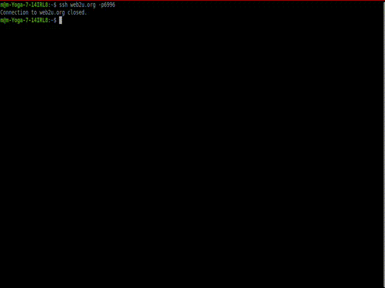

## The Game


sshOurboros -- multiplayer game where snake eats itself and grows

*To play go here `ssh web2u.org -p6996`*

*The Rules:*
1. The goal is to claim the most space
2. Secondary goal is to kill as many other snakes as you can
*The how:*
1. To claim space you need to either eat your own tail or reach tiles you've already claimed,
tiles that are enclosed when you do so become yours!
2. To kill other snakes you hit their tails
*To watchout:*
1. Other players can kill you
2. Other players can take your tiles.

## How does it work.

Basics:
1. Ssh Server with bubbleTea handler [code](https://github.com/MShel/sshOuroboros/blob/6414b3f53ffdf78659d68748a38c57c1aa111f21/cmd/server.go#L95-L120)
2. The ticker that moves everyone around [code](https://github.com/MShel/sshOuroboros/blob/6414b3f53ffdf78659d68748a38c57c1aa111f21/internal/game/GameManager.go#L96-L104)
3. The bubleTea awesome ui framework that powers views [code](https://github.com/MShel/sshOuroboros/blob/6414b3f53ffdf78659d68748a38c57c1aa111f21/internal/ui/GameView.go#L233)

Interesting parts:
1. The game is for at most 256 concurrent players through ssh (its limited by 256 colors available in the terminal) and an idea there is only 1 game at a time going on
2. We have [*254 bots*](https://github.com/MShel/sshOuroboros/blob/6414b3f53ffdf78659d68748a38c57c1aa111f21/internal/game/Config.go#L12) -- well thats ALL the colors that most terminals support the goal was to support as many bots as possible to make it more fun and more challenging to develop for myself
3. When you join you kill the bot [and take their place](https://github.com/MShel/sshOuroboros/blob/6414b3f53ffdf78659d68748a38c57c1aa111f21/internal/game/GameManager.go#L228-L230)
4. When all the colors are allocated by real people you can wait a bit and the color available [will appear itself in selection](https://github.com/MShel/sshOuroboros/blob/6414b3f53ffdf78659d68748a38c57c1aa111f21/internal/ui/SetupForm.go#L117-L125)
4. Map is big its 700x500 *chars* [code](https://github.com/MShel/sshOuroboros/blob/6414b3f53ffdf78659d68748a38c57c1aa111f21/internal/game/Config.go#L13-L14)
This can not be redndered on almost any screen so we utilize viewport [code](https://github.com/MShel/sshOuroboros/blob/6414b3f53ffdf78659d68748a38c57c1aa111f21/internal/ui/GameView.go#L236-L266)
to render the only "visible" area of map and we change it as player walks around
5. The bots have defined [strategy](https://github.com/MShel/sshOuroboros/blob/main/internal/game/DefaultStrategy.go) which is kinda derpy at the moment
6. The spacefiller is interesting in its simplicity we just take the first 2 tiles from surrounding areas that are not your color and its safe to assume that one of them is a seed tile for filling and so we go aheand and fill it [code](https://github.com/MShel/sshOuroboros/blob/6414b3f53ffdf78659d68748a38c57c1aa111f21/internal/game/SpaceFiller.go#L53-L105)

### Prerequisites

* **Go** (version 1.21+ recommended)
* A standard **SSH Client** (to connect and play)

### Installation and Run
Make sure you've got ssh key to use to run the server, use `ssh-keygen` command if not.
below `~/.ssh/pkey_for_ourboros` is private key used to [configure the server](https://github.com/MShel/sshOuroboros/blob/6414b3f53ffdf78659d68748a38c57c1aa111f21/cmd/server.go#L93)

1.  ```bash
    git clone https://github.com/MShel/sshOuroboros.git
    export OUROBOROS_PRIVATE_KEY_PATH="~/.ssh/pkey_for_game"
    cd sshOurboros
    go run cmd/server.go
    ```

2. `ssh localhost -p6996` port and host are defined [here](https://github.com/MShel/sshOuroboros/blob/6414b3f53ffdf78659d68748a38c57c1aa111f21/cmd/server.go#L26-L27)
